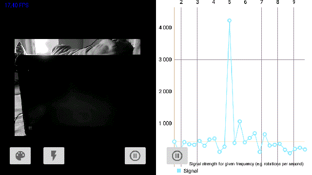
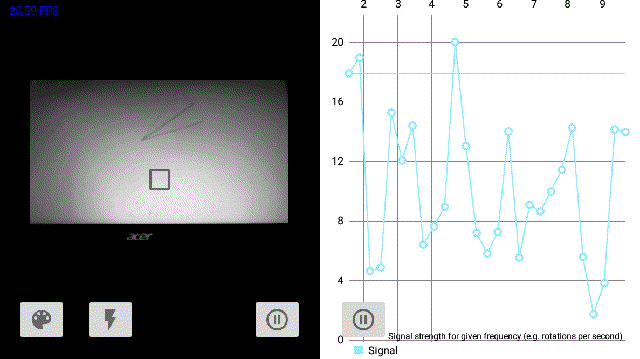

# MotionCam
Image frequency analyzer

Following app uses captured frames (center point from the middle and its color) to analize their potential frequency. Those can be useful when looking at stroboscopic light or rotating parts

It works as follows:
image capture (64 frames) -> aggregate color and FPS-> Maths including FFT -> push to chart

Image capturing is continuous, when it reaches 64 it runs on a second thread the analysis.

TODO
* frames to be captured - number to be optional
* points from the frame - number to be optional

Some images of the app:

  

    

  
  AVAILABLE ON PLAY STORE
 
  https://play.google.com/store/apps/details?id=com.diplabs.motioncam3&hl=pl&gl=US

LANGUAGES:
* JAVA + ANDROID
    
CREDITS:
* CHARTS: MPAndroidChart  https://github.com/PhilJay/MPAndroidChart
* MATH: commons-math3  https://commons.apache.org/proper/commons-math/
* IMAGE PROCESSING: OPENCV-ANDROID 4  https://opencv.org/android/
